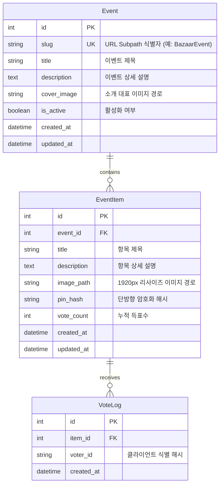

# 상세 개발 명세서 (SPECIFICATION.md)

- **문서 버전**: v1.0.0
- **작성일자**: 2026-10-05 11:25
- **프로젝트명**: VoteEvent 참여형 투표 이벤트 웹 플랫폼

---

## 1. 개요 및 기술 스택 (Technology Stack)

본 명세서는 [GOAL.md](file:///C:/Dev/python/voteEvent/GOAL.md) 및 [requirement.md](file:///C:/Dev/python/voteEvent/notes/requirement.md)에 기술된 요구사항을 바탕으로 구체적인 기술 스택, 아키텍처, 패키지 구성도, 세부 API 설계 및 데이터 모델링을 기술합니다.

### 1.1 기술 스택 선정 이유

| 레이어 | 기술 스택 | 선정 이유 |
| :--- | :--- | :--- |
| **Backend Framework** | **FastAPI (Python 3.10+)** | - 가볍고 빠른 비동기 처리 지원<br>- APIRouter를 통한 `DEFAULT_PREFIX` 서브라우팅 구성 용이<br>- Pydantic 기반 입력 데이터 검증 및 OpenAPI 문서 자동 생성 |
| **Template Engine** | **Jinja2** | - 서버 사이드 렌더링(SSR)을 통한 빠른 초기 로딩 및 SEO 친화적 페이지 구성<br>- FastAPI와의 완벽한 네이티브 연동 |
| **Database & ORM** | **SQLite + SQLAlchemy 2.0** | - 별도의 DB 서버 프로세스 없이 로컬 파일 기반으로 실행 가능한 독립성<br>- SQLAlchemy ORM을 통해 향후 PostgreSQL/MySQL로의 마이그레이션 용이 |
| **Image Processing** | **Pillow (PIL Fork)** | - Python 표준 이미지 처리 라이브러리<br>- 가로 폭 1920px 다운스케일링, EXIF 자동 회전, 압축 최적화의 높은 신뢰성 |
| **Frontend UI** | **HTML5 + Tailwind CSS (CDN) + Vanilla JS** | - 별도의 무거운 Node.js 빌드 파이프라인(webpack/vite) 없이 즉시 브라우저 실행 가능<br>- 세련된 반응형 디자인(Grid/Card/Modal) 및 비동기 Fetch API 투표 처리 지원 |
| **Security** | **hashlib (PBKDF2/SHA-256) + secrets** | - 핀번호(PIN) 단방향 솔트 해싱으로 암호화 안전성 보장 |

---

## 2. 아키텍처 및 패키지 구성도 (Package Structure)

```
voteEvent/
│
├── GOAL.md                     # 프로젝트 구현 목적 및 목표 요약
├── README.md                   # 프로젝트 실행 및 사용 가이드
├── requirements.txt            # 파이썬 의존 패키지 목록
├── .env.example                # 환경 변수 템플릿 (DEFAULT_PREFIX 등)
│
├── notes/                      # 개발 관리 산출물 디렉터리
│   ├── requirement.md          # 요구사항 명세서 (누적)
│   ├── SPECIFICATION.md        # 상세 개발 명세서
│   ├── history.md              # 요구사항 변경 및 요약 이력
│   ├── plan_202610051125.md    # 개발 계획 및 MVP 정의서
│   ├── req_202610051125.md     # 사용자 원본 요구사항 기록
│   └── result_202610051125.md  # 1차 산출물 생성 기록
│
├── app/                        # 메인 애플리케이션 패키지
│   ├── __init__.py
│   ├── main.py                 # FastAPI 애플리케이션 진입점 및 Prefix 설정
│   │
│   ├── core/                   # 핵심 설정 및 유틸리티
│   │   ├── __init__.py
│   │   ├── config.py           # 환경변수, DEFAULT_PREFIX, 업로드 경로 설정
│   │   ├── database.py         # SQLAlchemy 엔진 및 세션 관리
│   │   └── security.py         # 핀번호 해싱 및 검증 유틸리티
│   │
│   ├── models/                 # ORM 데이터 모델
│   │   ├── __init__.py
│   │   ├── event.py            # Event 엔티티
│   │   └── item.py             # EventItem 엔티티 및 VoteLog 엔티티
│   │
│   ├── schemas/                # Pydantic 요청/응답 스키마
│   │   ├── __init__.py
│   │   ├── event_schema.py
│   │   └── item_schema.py
│   │
│   ├── services/               # 비즈니스 로직
│   │   ├── __init__.py
│   │   ├── event_service.py    # 이벤트 CRUD 및 비즈니스 검증
│   │   ├── item_service.py     # 항목 등록/수정/삭제/PIN 검증
│   │   ├── vote_service.py     # 투표 로깅 및 집계 로직
│   │   └── image_service.py    # Pillow 기반 1920px 리사이즈 파이프라인
│   │
│   ├── routers/                # 웹 및 API 라우터
│   │   ├── __init__.py
│   │   ├── admin_router.py     # 관리자 페이지 및 이벤트 CRUD 라우터
│   │   ├── event_view_router.py# 이벤트 서브패스(/votes/{eventName}) 라우터
│   │   ├── item_router.py      # 항목 등록/수정/삭제 API 라우터
│   │   └── vote_router.py      # 투표/좋아요 비동기 API 라우터
│   │
│   ├── templates/              # Jinja2 HTML 템플릿
│   │   ├── base.html           # 공통 레이아웃 (네비게이션, CDN, 모달)
│   │   ├── admin/
│   │   │   ├── event_list.html # 관리자 이벤트 목록
│   │   │   └── event_form.html # 관리자 이벤트 생성/수정 폼
│   │   └── event/
│   │       ├── detail.html     # 이벤트 참가자/관람자 메인 뷰 (간략보기 + 모달)
│   │       └── 404.html        # 이벤트 미존재 안내 페이지
│   │
│   └── static/                 # 정적 리소스
│       ├── css/
│       │   └── custom.css      # 커스텀 스타일 (모달 애니메이션 등)
│       └── js/
│           ├── vote.js         # 비동기 투표 및 로컬스토리지 상태 관리
│           ├── modal.js        # 상세 보기 모달 및 핀번호 인증 모달 제어
│           └── item_action.js  # 항목 등록/수정/삭제 폼 처리
│
└── data/                       # 로컬 저장소 (DB 및 업로드 미디어)
    ├── vote_event.db           # SQLite DB 파일
    └── uploads/                # 업로드된 최적화 이미지 저장 경로
        ├── covers/             # 이벤트 대표 커버 이미지
        └── items/              # 참여 항목 업로드 이미지 (최대폭 1920px 변환본)
```

---

## 3. 기능 세부 내역 및 API 엔드포인트 명세

모든 웹 및 API 엔드포인트는 `DEFAULT_PREFIX` (기본값: `/votes`)를 상위 경로로 가집니다.

### 3.1 라우팅 맵 (Routing Map)

| 분류 | HTTP Method | URL Path (기본 Prefix 포함) | 설명 | 응답 형식 |
| :--- | :---: | :--- | :--- | :---: |
| **System** | `GET` | `/` | 기본 Prefix(`/votes`)로 302 리다이렉트 | Redirect |
| **Admin** | `GET` | `/votes` 또는 `/votes/admin` | 관리자 이벤트 목록 페이지 | HTML |
| **Admin** | `GET` | `/votes/admin/create` | 이벤트 생성 폼 페이지 | HTML |
| **Admin** | `POST` | `/votes/admin/create` | 이벤트 생성 처리 (멀티파트 폼) | Redirect/HTML |
| **Admin** | `GET` | `/votes/admin/{event_id}/edit` | 이벤트 수정 폼 페이지 | HTML |
| **Admin** | `POST` | `/votes/admin/{event_id}/edit` | 이벤트 수정 처리 | Redirect/HTML |
| **Admin** | `POST` | `/votes/admin/{event_id}/delete` | 이벤트 삭제 처리 (하위항목 및 파일 일괄삭제) | JSON/Redirect |
| **Public UX** | `GET` | `/votes/{eventName}` | 이벤트 랜딩 페이지 (대표소개, 항목 간략보기/모달) | HTML |
| **Item API** | `POST` | `/votes/api/items` | 참여 항목 등록 (제목, 설명, 핀번호, 이미지 업로드) | JSON |
| **Item API** | `GET` | `/votes/api/items/{item_id}` | 참여 항목 상세 조회 (자세히보기 모달용) | JSON |
| **Item API** | `PUT` | `/votes/api/items/{item_id}` | 참여 항목 수정 (핀번호 검증 필수) | JSON |
| **Item API** | `DELETE`| `/votes/api/items/{item_id}` | 참여 항목 삭제 (핀번호 검증 필수) | JSON |
| **Vote API** | `POST` | `/votes/api/items/{item_id}/vote` | 좋아요(투표) 행사 | JSON |

---

## 4. 데이터베이스 및 스키마 명세



### 4.1 테이블 세부 컬럼 정의
1. **`events`**:
   - `id`: INTEGER PRIMARY KEY AUTOINCREMENT
   - `slug`: VARCHAR(64) UNIQUE NOT NULL (URL 경로용: `/votes/{slug}`)
   - `title`: VARCHAR(200) NOT NULL
   - `description`: TEXT NULL
   - `cover_image`: VARCHAR(255) NULL
   - `is_active`: BOOLEAN DEFAULT 1
   - `created_at`: DATETIME DEFAULT CURRENT_TIMESTAMP
   - `updated_at`: DATETIME DEFAULT CURRENT_TIMESTAMP
2. **`event_items`**:
   - `id`: INTEGER PRIMARY KEY AUTOINCREMENT
   - `event_id`: INTEGER NOT NULL (FOREIGN KEY REFERENCES events(id) ON DELETE CASCADE)
   - `title`: VARCHAR(200) NOT NULL
   - `description`: TEXT NULL
   - `image_path`: VARCHAR(255) NOT NULL
   - `pin_hash`: VARCHAR(128) NOT NULL (Salt + Hash)
   - `vote_count`: INTEGER DEFAULT 0
   - `created_at`: DATETIME DEFAULT CURRENT_TIMESTAMP
   - `updated_at`: DATETIME DEFAULT CURRENT_TIMESTAMP
3. **`vote_logs`**:
   - `id`: INTEGER PRIMARY KEY AUTOINCREMENT
   - `item_id`: INTEGER NOT NULL (FOREIGN KEY REFERENCES event_items(id) ON DELETE CASCADE)
   - `voter_id`: VARCHAR(64) NOT NULL
   - `created_at`: DATETIME DEFAULT CURRENT_TIMESTAMP

---

## 5. 비즈니스 로직 및 알고리즘 세부 설계

### 5.1 이미지 리사이즈 파이프라인 (`image_service.py`)
- **목적**: 대용량 고해상도 이미지 업로드 시 가로 폭을 최대 1920px로 다운스케일링하고 압축하여 저장
- **처리 알고리즘**:
  1. 클라이언트가 전송한 바이너리 스트림을 Pillow `Image.open()`으로 로드.
  2. EXIF 메타데이터를 확인하여 스마트폰 등에서 촬영된 이미지의 회전(`Orientation`) 플래그를 감지하고 `ImageOps.exif_transpose()`를 적용하여 방향 보정.
  3. 원본 크기 `(original_width, original_height)` 계산:
     - `if original_width > 1920`:
       - `new_width = 1920`
       - `new_height = int(original_height * (1920 / original_width))`
       - 고품질 리샘플링 필터(`Resampling.LANCZOS`)를 적용하여 리사이즈 실행.
     - `else`: 원본 해상도 유지.
  4. RGB 모드 변환(RGBA인 경우 투명도 보존 또는 JPEG/WebP 변환 처리).
  5. 고유 파일명(UUID4 + `.webp` 또는 `.jpg`) 생성 후 지정 디렉터리에 저장 (품질 85% 최적화).
  6. 저장된 상대 경로 반환.

### 5.2 핀번호(PIN) 보안 및 검증 파이프라인 (`security.py`)
- **목적**: 작성자가 등록 시 지정한 핀번호로만 수정/삭제 권한 통제
- **처리 알고리즘**:
  - **해싱**: `pin_raw` 입력 시 16바이트 랜덤 솔트(`secrets.token_hex(16)`) 생성 후 `hashlib.pbkdf2_hmac('sha256', pin_raw.encode(), salt, 100000)` 수행.
  - **저장 포맷**: `"{salt}${hash_hex}"` 형태로 DB에 보관.
  - **검증**: 클라이언트가 수정/삭제 시 전송한 `pin_input`을 기존 레코드의 `salt`로 재해싱하여 `hmac.compare_digest()`로 안전 대조.

### 5.3 좋아요(투표) 처리 파이프라인 (`vote_service.py`)
- **처리 흐름**:
  1. 클라이언트가 간략보기 또는 상세 뷰에서 좋아요 버튼 클릭.
  2. 비동기 POST `/votes/api/items/{item_id}/vote` 요청 전송.
  3. 쿠키/로컬스토리지 식별자 및 클라이언트 IP 해시 생성.
  4. 중복 투표 방지 정책 체크 (동일 식별자의 중복 투표 감지 시 알림 또는 허용 정책에 따라 분기).
  5. 원자적(Atomic) 쿼리로 `vote_count = vote_count + 1` 업데이트 및 `VoteLog` 기록.
  6. 갱신된 최신 `vote_count`를 JSON으로 반환하여 프론트엔드 UI에 즉시 반영.

---

## 6. UI/UX 화면 구성 명세

### 6.1 관리자 이벤트 관리 페이지 (`/votes` 또는 `/votes/admin`)
- **헤더**: 플랫폼 로고, "새 이벤트 개설" 버튼
- **메인 영역**: 등록된 이벤트 카드 그리드
  - 커버 이미지, 이벤트 이름(slug), 이벤트 제목, 참여 항목 수, 총 누적 투표수
  - 이벤트 바로가기 링크 (`/votes/{slug}`) - 원클릭 복사 버튼 제공
  - 관리 액션: "수정", "삭제" 버튼

### 6.2 이벤트 전용 상세 페이지 (`/votes/{eventName}`)
- **상단 히어로 섹션 (Hero Section)**:
  - 이벤트 대표 소개 이미지 (배너)
  - 이벤트 제목 및 상세 설명 안내문
  - 실시간 통계 칩: 총 참여 항목 N개, 총 투표수 M표
  - CTA 버튼: **"🎨 내 작품/항목 참여하기"** (클릭 시 등록 모달 오픈)
- **하위 항목 갤러리 섹션 (Gallery Section)**:
  - 정렬 옵션 제공 (최신순 / 인기 투표순)
  - **간략보기 카드 컴포넌트**:
    - 리사이즈된 이미지 썸네일 (Hover 시 확대 효과)
    - 항목 제목
    - 설명 일부 (2~3줄 말줄임 처리 `line-clamp-2`)
    - 하단 액션바:
      - ❤️ **좋아요(투표) 버튼**: 현재 투표수 표시, 원클릭 투표 즉시 반영
      - 🔍 **자세히보기 버튼**: 클릭 시 상세 모달 오픈
- **자세히보기 모달 (Detail Modal)**:
  - 고해상도(최대 1920px) 원본 비율 이미지 뷰어
  - 등록자 항목 제목, 전체 설명 본문, 등록일시
  - 투표 버튼 및 실시간 득표수
  - 관리 액션 드롭다운 또는 버튼: "수정", "삭제" (클릭 시 핀번호 입력창 활성화)
- **항목 등록/수정 모달**:
  - 제목 입력 (필수)
  - 설명 입력 (텍스트에어리어)
  - 이미지 파일 업로드 (드래그 앤 드롭 및 파일 미리보기 지원)
  - 핀번호 입력 (4자리 이상 숫자/문자)

---

## 7. 개발 검토 시 필요한 제약사항 (Constraints)

1. **파일 시스템 및 스토리지 제약**:
   - 업로드 디렉터리(`data/uploads/...`)에 대한 OS 차원의 쓰기/읽기 권한 보장 필요.
   - 단일 이미지 업로드 최대 파일 크기는 네트워크 및 메모리 보호를 위해 15MB로 제한하되, 서버 수신 후 즉시 1920px 다운스케일링하여 실제 저장 용량은 수백 KB 수준으로 최적화.
2. **식별자(Slug) 명명 제약**:
   - 이벤트 서브패스(`eventName`)는 URL Path에 직접 매핑되므로 공백이나 특수문자를 제한하고 영숫자, 하이픈(`-`), 언더스코어(`_`)만 허용해야 함.
   - 시스템 예약어(`admin`, `api`, `static`, `uploads` 등)와의 충돌 방지 검증 로직 필수.
3. **트랜잭션 및 파일 동기화 제약**:
   - 항목 삭제 또는 수정 시 DB 롤백이 발생할 경우 파일 시스템과의 불일치가 발생하지 않도록 안전한 파일 삭제 핸들러 구현.
4. **동시성 및 투표 무결성**:
   - 여러 사용자가 동시에 투표할 때 Race Condition 방지를 위해 DB 차원의 원자적 업데이트(`update(vote_count = vote_count + 1)`) 실행.

---

## 8. 추가 개발 제안 내용 (Future Proposals)

1. **소셜 공유(OpenGraph) 및 QR 코드 자동 생성**:
   - `/votes/{eventName}` 전용 QR 코드를 관리자 화면 및 이벤트 화면에 생성하여 오프라인 행사장(예: 바자회, 전시회)에서 참가자가 스마트폰 카메라로 즉시 접속할 수 있도록 지원.
   - 카카오톡, 페이스북, 트위터 공유 시 이벤트 대표 이미지와 제목이 표시되도록 OpenGraph 메타 태그 동적 삽입.
2. **투표 기간(시작일/종료일) 자동 타이머**:
   - 이벤트 모델에 `start_at`, `end_at` 필드를 두어 투표 가능 기간을 통제하고, 종료 후에는 투표 버튼이 비활성화되며 최종 순위(1, 2, 3위 수상작) 뱃지를 부여하는 기능.
3. **부정 투표 방지 고도화**:
   - 현재 로컬스토리지 + IP 해시 1차 방어에서 나아가 Google reCAPTCHA v3 연동 또는 일회성 서명 토큰 발급 체계 도입.
4. **항목 댓글/응원 메시지 기능**:
   - 투표와 더불어 각 하위 항목에 참여자를 응원하는 한 줄 댓글을 등록할 수 있는 커뮤니티 기능 확장.
