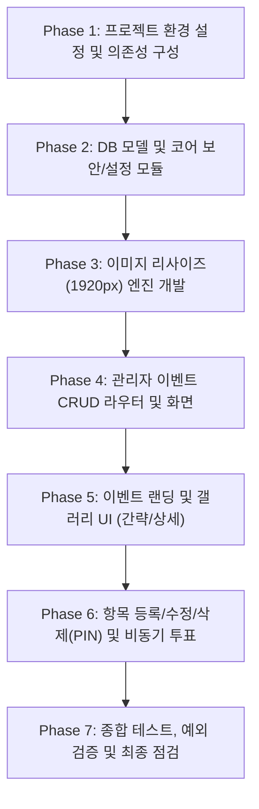

# 개발 계획 및 MVP 정의서 (plan_202610051125.md)

- **작성 일시**: 2026-10-05 11:25
- **연관 문서**: [GOAL.md](file:///C:/Dev/python/voteEvent/GOAL.md), [requirement.md](file:///C:/Dev/python/voteEvent/notes/requirement.md), [SPECIFICATION.md](file:///C:/Dev/python/voteEvent/notes/SPECIFICATION.md)

---

## 1. 최소 기능 제품 (MVP: Minimum Viable Product) 정의

VoteEvent의 성공적인 런칭 및 사용자 검증을 위해 반드시 구현되어야 하는 핵심 MVP 범위를 아래와 같이 정의합니다.

### 1.1 MVP 포함 필수 기능 (In Scope)
1. **Base Path 라우팅 구조**:
   - `DEFAULT_PREFIX` (기본값 `/votes`)를 기준으로 관리자 및 퍼블릭 서비스 라우팅 격리
   - 루트 경로(`/`) 접근 시 `/votes`로 자동 안내/리다이렉트
2. **관리자 이벤트 관리**:
   - 이벤트 등록 (이름/Slug, 제목, 설명, 대표 소개 이미지 업로드)
   - 이벤트 목록 조회, 수정, 삭제 (연관 항목 및 이미지 자동 정리)
3. **사용자 친화적 Subpath 이벤트 랜딩 UX**:
   - `/votes/{eventName}` (예: `/votes/BaazarEvent`) 주소로 바로 접근 가능한 전용 이벤트 화면
   - 상단 이벤트 소개 배너 및 요약 통계(참여수, 총 투표수)
4. **참여자 하위 항목 등록 및 PIN 보안**:
   - 제목, 설명, 이미지 파일 업로드
   - 수정/삭제 권한 통제를 위한 핀번호(PIN) 등록 및 단방향 Salted Hash 저장
5. **대용량 이미지 1920px 다운스케일링 파이프라인**:
   - 업로드된 이미지 폭이 1920px 초과 시 비율 유지 1920px 리사이즈 및 경량화 압축 저장
6. **하위 항목 듀얼 뷰 모드**:
   - **간략보기 (Card Grid View)**: 썸네일, 제목, 요약 텍스트, 즉시 "투표하기(좋아요)" 버튼
   - **자세히보기 (Detail Modal)**: 고화질 이미지, 전체 본문, 실시간 투표수, "수정/삭제" 버튼
7. **핀번호 검증 기반 수정/삭제**:
   - 작성 시 등록한 핀번호와 일치할 때만 항목 내용 수정 및 삭제 허용
8. **비동기 좋아요(투표) 시스템**:
   - 페이지 새로고침 없이 원클릭으로 투표 카운트 반영 및 로컬스토리지 기반 중복 투표 1차 방지

### 1.2 MVP 제외 및 2단계 고도화 항목 (Out of Scope for MVP)
- 다중 관리자 계정 권한 및 OAuth 소셜 로그인 (MVP는 단일 관리자 또는 기본 대시보드 형태 제공)
- 투표 실시간 랭킹 차트/시각화 그래프
- SMS/이메일 알림 연동

---

## 2. 개발 세부 요구 계획 (Step-by-Step Execution Plan)

### Phase 1: 프로젝트 기반 환경 및 의존성 구성
- **작업 내용**:
  1. 가상환경 및 `requirements.txt` 정의 (FastAPI, Uvicorn, Jinja2, SQLAlchemy, Pillow, Python-Multipart 등)
  2. `.env` 및 `core/config.py` 구성 (`DEFAULT_PREFIX = "/votes"`, 업로드 디렉터리 경로 설정)
  3. 디렉터리 구조 자동 생성 및 정적 리소스(Tailwind CSS CDN, 기본 커스텀 스타일) 준비

### Phase 2: 데이터 모델링 및 코어 모듈 구축
- **작업 내용**:
  1. SQLAlchemy 기반 `Event`, `EventItem`, `VoteLog` 엔티티 정의 ([SPECIFICATION.md](file:///C:/Dev/python/voteEvent/notes/SPECIFICATION.md) 참조)
  2. SQLite DB 초기화 및 세션 라이프사이클 관리 모듈(`core/database.py`) 작성
  3. 핀번호 암호화 및 검증 모듈(`core/security.py`) 구현 (PBKDF2/SHA-256 + Salt)

### Phase 3: 이미지 처리 파이프라인 구현
- **작업 내용**:
  1. Pillow 기반 `services/image_service.py` 구현
  2. EXIF 회전각 자동 보정 (`ImageOps.exif_transpose`)
  3. 가로 폭 1920px 초과 시 종횡비 유지 리사이징 (`Resampling.LANCZOS`)
  4. UUID 기반 파일명 생성 및 안전한 저장 처리, 이미지 삭제 유틸리티 구현

### Phase 4: 관리자 이벤트 관리 기능 개발
- **작업 내용**:
  1. 관리자 전용 대시보드 (`GET /votes` / `GET /votes/admin`) 화면 개발
  2. 이벤트 등록/수정 폼 및 유효성 검사 (Slug 중복 방지, 영숫자 유효성)
  3. 이벤트 삭제 처리 (하위 항목 및 저장 파일 연쇄 삭제)

### Phase 5: 사용자 이벤트 랜딩 및 갤러리 UI 개발
- **작업 내용**:
  1. 서브패스 라우터 (`GET /votes/{eventName}`) 개발
  2. 이벤트 대표 배너, 이벤트 설명, 통계 요약 헤더 컴포넌트 구현
  3. 참여 항목 간략보기 그리드 카드(썸네일, 제목, 줄바꿈 말줄임 설명, 즉시 투표 버튼) 렌더링
  4. 자세히보기 모달 UI 렌더링 및 상태 제어 스크립트 작성

### Phase 6: 항목 등록, 수정, 삭제(PIN) 및 비동기 투표 구현
- **작업 내용**:
  1. 참여 항목 등록 모달 및 API (`POST /votes/api/items`)
  2. 항목 수정 모달 및 핀번호 검증 API (`PUT /votes/api/items/{id}`)
  3. 항목 삭제 및 핀번호 검증 API (`DELETE /votes/api/items/{id}`)
  4. 비동기 투표 API (`POST /votes/api/items/{id}/vote`) 및 로컬스토리지 기반 UI 상태 동기화

### Phase 7: 통합 검증 및 시연 준비
- **작업 내용**:
  1. 대용량(1920px 초과) 이미지 업로드 시 리사이징 결과 검증
  2. 핀번호 오입력 시 수정/삭제 거부 동작 검증
  3. 간략보기 즉시 투표 및 실시간 카운트 증감 검증
  4. 전체 시나리오 E2E 테스트 및 산출물 보고서 작성

---

## 3. 일정 및 리소스 산정

| 단계 | 예상 소요 작업 | 산출물 |
| :---: | :--- | :--- |
| **Phase 1~3** | 기반 세팅, DB 모델, 이미지 파이프라인 | `requirements.txt`, `config.py`, `models/`, `image_service.py` |
| **Phase 4** | 관리자 이벤트 CRUD | `admin_router.py`, `admin/event_list.html`, `admin/event_form.html` |
| **Phase 5~6** | 서브패스 랜딩, 듀얼 뷰, PIN 인증, 투표 | `event_view_router.py`, `detail.html`, `vote.js`, `modal.js` |
| **Phase 7** | 통합 테스트 및 기능 검증 | 단위/통합 테스트 스크립트, 결과 보고서 |

---

## 4. 리뷰 및 승인 체크포인트
- [x] 사용자 요구사항 전체의 기능적 해석 일치 여부
- [x] Base Path(`DEFAULT_PREFIX=/votes`) 및 이벤트 서브패스 접근 UX 검증
- [x] 1920px 다운스케일링 파이프라인의 명확성
- [x] 하위 항목 핀번호 기반 권한 통제 보안 모델의 적절성
- [ ] **사용자 리뷰 및 개발 진행 최종 승인**
