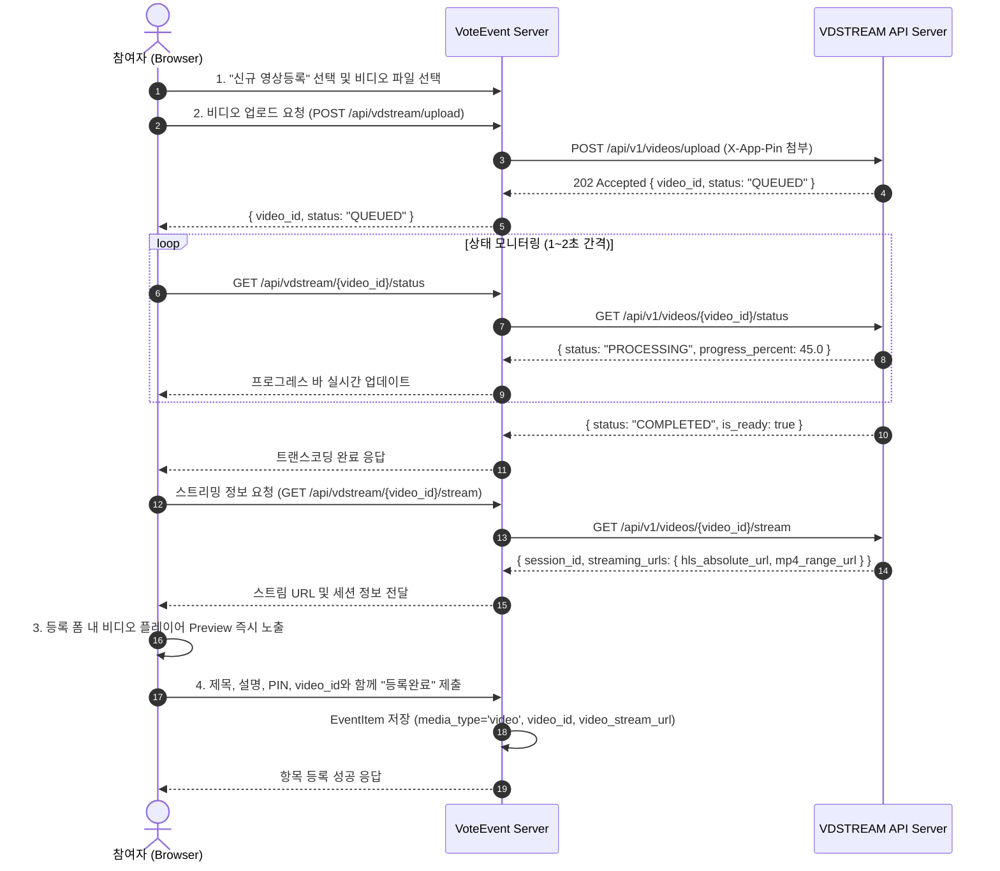

# 투표이벤트 참여 항목 동영상(VDSTREAM) 등록 및 스트리밍 지원 개발 계획서

- **문서 버전**: v1.0.0
- **작성일**: 2026-10-07
- **작성 목적**: 투표이벤트 참여 항목에 기존 이미지 외에 VDSTREAM 연동 비디오(동영상) 등록, 트랜스코딩 모니터링, 카드/상세보기 실시간 스트리밍 재생 지원을 위한 상세 설계 및 개발 계획 수립

---

## 1. 개요 및 배경

현재 `VoteEvent` 플랫폼은 참여 항목(EventItem) 등록 시 **이미지 파일(`image_path`)**만 등록할 수 있도록 구현되어 있습니다.
이를 확장하여 사용자가 **이미지뿐만 아니라 동영상(비디오) 파일**도 간편하게 등록하고, 스트리밍 서버(`https://holyseeds.thewayworks.net/vdstream`)와 실시간 연동하여 인코딩 진행률 확인 후 등록을 완료할 수 있도록 합니다.

또한, 참여 항목 갤러리 카드(간략보기) 및 상세 모달(자세히보기)에서 이미지와 동영상 각각에 최적화된 고품질 미리보기(Preview)와 전체화면 스트리밍 재생 환경을 제공합니다.

---

## 2. 연동 대상: VDSTREAM 스트리밍 서비스 API 분석

`C:\Dev\python\vdstream\vdstream-api.md` 명세에 따른 핵심 기능 및 정책:

| 구분 | 주요 명세 및 제약사항 | VoteEvent 연동 반영 방안 |
| :--- | :--- | :--- |
| **기본 경로** | `https://holyseeds.thewayworks.net/vdstream/api/v1` | `core/config.py`에 `VDSTREAM_BASE_URL` 환경변수 등록 |
| **인증** | Header `X-App-Pin: 1234` | 백엔드 프록시 또는 서버 간 통신 시 `VDSTREAM_PIN` 자동 주입 |
| **비디오 업로드** | `POST /api/v1/videos/upload` (multipart/form-data) | 202 Accepted 수신, `video_id` 획득 |
| **트랜스코딩 조회** | `GET /api/v1/videos/{video_id}/status` | 1~2초 간격 실시간 진행률(0~100%) 및 상태 폴링 |
| **스트림 정보 획득** | `GET /api/v1/videos/{video_id}/stream` | 트랜스코딩 `COMPLETED` 시 `hls_absolute_url`, `mp4_range_url`, `session_id` 획득 |
| **세션 하트비트** | `POST /api/v1/streams/{session_id}/heartbeat` | 모달 재생 중 15초 간격 하트비트 전송 (동시 시청 슬롯 유지) |
| **세션 해제** | `POST /api/v1/streams/{session_id}/release` | 모달 닫힘 또는 브라우저 이탈 시 슬롯 즉시 반환 (동시 5명 제한 관리) |
| **비디오 삭제** | `DELETE /api/v1/videos/{video_id}` | 항목 삭제(Delete) 시 VDSTREAM 원격 비디오 파일 동시 삭제 |

---

## 3. 시스템 아키텍처 및 연동 흐름 설계

### 3.1 아키텍처 구성 (Backend Proxy 방식 채택)
- **보안 및 안정성 최적화**: VDSTREAM의 `X-App-Pin` 보안 핀번호가 클라이언트 브라우저에 직접 노출되지 않고, CORS 문제를 방지하기 위해 VoteEvent 백엔드에 VDSTREAM 중계/프록시 엔드포인트를 제공합니다.
- **클라이언트 UX**: 브라우저는 VoteEvent API(`/api/vdstream/...`)를 호출하여 프로그레스 바와 프리뷰를 매끄럽게 처리합니다.



---

## 4. 데이터베이스 및 스키마 변경 설계

### 4.1 `EventItem` 모델 확장 (`app/models/item.py`)
기존 `image_path` 컬럼이 `nullable=False`였던 구조를 동영상도 수용할 수 있도록 수정하고, 비디오 관련 메타데이터 컬럼을 추가합니다.

```python
class EventItem(Base):
    __tablename__ = "event_items"

    id = Column(Integer, primary_key=True, index=True)
    event_id = Column(Integer, ForeignKey("events.id", ondelete="CASCADE"), nullable=False, index=True)
    title = Column(String(200), nullable=False)
    description = Column(Text, nullable=True)
    
    # 미디어 타입 구분 ('image' | 'video')
    media_type = Column(String(20), default="image", nullable=False)
    
    # 이미지인 경우 필수, 비디오인 경우 선택(썸네일 등)
    image_path = Column(String(255), nullable=True)
    
    # 비디오 관련 필드 (media_type == 'video'인 경우)
    video_id = Column(String(64), nullable=True, index=True)
    video_stream_url = Column(String(500), nullable=True)
    video_status = Column(String(30), default="COMPLETED", nullable=True)
    video_duration = Column(Float, nullable=True)
    
    pin_hash = Column(String(128), nullable=False)
    vote_count = Column(Integer, default=0, nullable=False, index=True)
    created_at = Column(DateTime, default=utc_now)
    updated_at = Column(DateTime, default=utc_now, onupdate=utc_now)
```

### 4.2 SQLite 마이그레이션 호환성
- 기존 데이터베이스 테이블에 신규 컬럼이 없을 경우 서버 시작(`init_db()`) 시 `ALTER TABLE event_items ADD COLUMN ...`을 안전하게 자동 실행하여 기존 데이터 및 테스트와의 무중단 하위 호환성을 유지합니다.

---

## 5. UI/UX 화면별 구현 계획

### 5.1 항목 등록 모달 (Create Item Modal)
1. **미디어 등록 영역 개선**:
   - 상단에 **[ 📷 이미지 등록 ]** 및 **[ 🎬 신규 영상등록 ]** 선택 탭/버튼 제공.
   - "신규 영상등록" 선택 시:
     - 비디오 파일 선택창(`.mp4`, `.mov`, `.webm`, `.mkv` 지원, 최대 100MB / 10분 안내).
     - 파일 선택 시 자동으로 업로드 진행 -> **실시간 프로그레스 바**(진행률 % 및 상태 메시지) 노출.
     - 트랜스코딩 중에는 "등록하기" 버튼이 비활성화되며, "720p H.264 변환 중 (45%)..." 안내.
     - 트랜스코딩 `COMPLETED` 완료 시:
       - 폼 내부에 **비디오 플레이어 미리보기(Preview)** 영역 즉시 렌더링.
       - 재생/일시정지 확인 가능.
       - "등록하기" 버튼 활성화.

### 5.2 참여 항목 카드 (갤러리 리스트 그리드)
- **이미지 항목**: 기존과 동일하게 고화질 썸네일 이미지 및 마우스 오버 확대 효과.
- **동영상 항목**:
  - 카드 상단 미디어 영역에 **동영상 프리뷰** 제공:
    - 자동 음소거(Muted) 비디오 프리뷰 또는 마우스 호버 시 프리뷰 재생.
    - 우측 상단/좌측 하단에 `[ 🎬 동영상 ]` 인디케이터 배지 표시.
    - 클릭 시 상세 모달 오픈.

### 5.3 상세 보기 모달 (Detail View Modal)
- **이미지 항목**: 고화질 원본비율 이미지 전체보기 노출 (기존 유지).
- **동영상 항목**:
  - 모달 상단에 반응형 **동영상 전체보기 플레이어**(`controls`, `autoplay`, 음성 출력 가능) 노출.
  - HLS 스트리밍 재생 지원 (Hls.js 또는 브라우저 기본 지원 활용).
  - **세션 생명주기 관리**:
    - 모달 열릴 때: 스트리밍 세션 발급 및 15초 주기 하트비트(`/heartbeat`) 타이머 가동.
    - 모달 닫힐 때: 재생 즉시 중단, 하트비트 타이머 종료, `/release` API 호출하여 동시 시청 슬롯(최대 5개) 반환.

### 5.4 항목 수정 및 삭제
- **수정(Edit)**: 핀번호 확인 후 제목, 설명 수정 및 미디어(이미지/동영상) 교체 기능 지원.
- **삭제(Delete)**: 핀번호 확인 후 DB 삭제 시, 만약 비디오 항목인 경우 VDSTREAM의 `DELETE /api/v1/videos/{video_id}`를 호출하여 원격 비디오 파일 자원까지 깔끔하게 정리.

---

## 6. 구현 단계 (Phases)

| 단계 | 작업 내용 | 세부 내역 |
| :---: | :--- | :--- |
| **Phase 1** | **설정 및 VDSTREAM 연동 서비스 모듈 구축** | • `app/core/config.py`: `VDSTREAM_BASE_URL`, `VDSTREAM_PIN` 추가<br>• `app/services/vdstream_service.py`: 업로드, 상태 폴링, 스트림 정보, 세션 해제, 비디오 삭제 클라이언트 구현 |
| **Phase 2** | **DB 모델 및 스키마 확장 & 마이그레이션** | • `app/models/item.py`: `media_type`, `video_id`, `video_stream_url` 등 필드 추가<br>• `app/core/database.py`: 기존 DB 컬럼 자동 추가 마이그레이션 헬퍼 작성<br>• `app/schemas/item_schema.py`: 미디어 필드 추가 |
| **Phase 3** | **백엔드 API 엔드포인트 구현** | • `app/routers/item_router.py`: 비디오 업로드/상태 조회 프록시 API 및 비디오 참여 항목 등록/수정/삭제 로직 확장 |
| **Phase 4** | **프론트엔드 UI/UX 구현 (`detail.html`)** | • 등록 모달: 신규 영상등록 버튼, 트랜스코딩 진행률 프로그레스 바, 인라인 플레이어 Preview 구현<br>• 카드 그리드: 비디오 태그 프리뷰 및 동영상 배지 렌더링<br>• 상세 모달: 비디오 전체보기 플레이어, HLS 재생, 세션 하트비트/릴리즈 스크립트 구축 |
| **Phase 5** | **단위 및 통합 테스트, 검증** | • Mock 기반 VDSTREAM 비디오 업로드/인코딩/등록 E2E 테스트<br>• 기존 9개 pytest 테스트 회귀 검증<br>• 실제 VDSTREAM 서버 통신 연결성 확인 |

---

## 7. 검토 및 확인 요청 사항 (Review Points)

1. **VDSTREAM 접속 정보 및 도메인 확인**:
   - 제공해주신 `https://holyseeds.thewayworks.net/vdstream` 엔드포인트 및 기본 PIN(`1234`)이 환경변수로 주입 가능하도록 기본값을 구성할 예정입니다.
2. **동영상 미리보기 재생 방식**:
   - 카드 그리드에서 마우스 호버 시 음소거 재생(Hover Play) 방식과 기본 비디오 포스터/클릭 시 재생 방식 중 어느 것을 선호하시는지 확인. (기본 제안: 호버 시 음소거 미리보기 재생 및 동영상 배지 부착)
3. **비디오 삭제 정책**:
   - 참여 항목을 삭제할 때 VDSTREAM 서버에 등록된 원격 비디오 파일도 함께 삭제 처리하는 정책을 기본으로 적용할 예정입니다.
