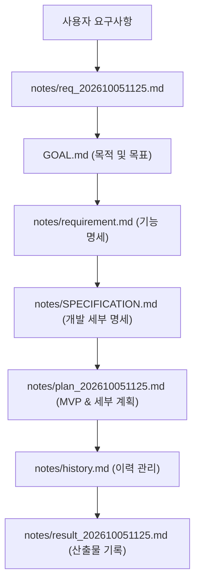

# 산출물 생성 기록 (result_202610051125.md)

- **작성 일시**: 2026-10-05 11:25
- **수행 작업**: 초기 요구사항 분석, 목적/목표 수립, 상세 명세 및 개발 계획 수립

---

## 1. 생성된 산출물 목록

| 번호 | 파일 경로 | 주요 내용 및 목적 | 상태 |
| :---: | :--- | :--- | :---: |
| 1 | [GOAL.md](file:///C:/Dev/python/voteEvent/GOAL.md) | 프로젝트 구현 목적, 핵심 목표(관리자, 참여자, 관람자, 이미지 처리), 전체 구현 요약 | 작성 완료 |
| 2 | [notes/requirement.md](file:///C:/Dev/python/voteEvent/notes/requirement.md) | 사용자 요구사항의 기능적/비기능적 해석, 데이터 엔티티 요구사항, 추적 매트릭스 (누적 관리) | 작성 완료 |
| 3 | [notes/SPECIFICATION.md](file:///C:/Dev/python/voteEvent/notes/SPECIFICATION.md) | 기술 스택(FastAPI, Jinja2, SQLite, Pillow, Tailwind), 패키지 구성도, API 엔드포인트, DB 스키마/ERD, 1920px 리사이즈 및 PIN 해싱 알고리즘, 제약사항 및 제안 | 작성 완료 |
| 4 | [notes/plan_202610051125.md](file:///C:/Dev/python/voteEvent/notes/plan_202610051125.md) | MVP 범위 정의(In-Scope/Out-of-Scope), Phase 1~7 단계별 개발 세부 실행 계획 및 체크포인트 | 작성 완료 |
| 5 | [notes/history.md](file:///C:/Dev/python/voteEvent/notes/history.md) | 요구사항 요약 및 변경 이력 기록 | 작성 완료 |
| 6 | [notes/req_202610051125.md](file:///C:/Dev/python/voteEvent/notes/req_202610051125.md) | 사용자 원본 요구사항 전문 인용 및 요소별 분해 분석 기록 | 작성 완료 |
| 7 | [notes/result_202610051125.md](file:///C:/Dev/python/voteEvent/notes/result_202610051125.md) | 본 산출물 생성 기록 문서 | 작성 완료 |

---

## 2. 산출물 간 구조 및 연계 관계

---

## 3. 핵심 설계 요약

1. **URL 라우팅 구조**:
   - `DEFAULT_PREFIX` (기본값 `/votes`)를 중앙 설정으로 관리
   - 관리자 경로: `/votes` (대시보드), `/votes/admin/create`, `/votes/admin/{id}/edit` 등
   - 퍼블릭 랜딩 경로: `/votes/{eventName}` (예: `/votes/BazaarEvent`)
2. **참여 항목 및 PIN 보안**:
   - 누구나 제목, 설명, 이미지를 등록할 수 있으며 4자리 이상의 핀번호 등록 필수
   - 핀번호는 Salted PBKDF2/SHA-256 해시로 저장되어 안전하게 수정/삭제 권한 검증
3. **듀얼 뷰 & 비동기 좋아요(투표)**:
   - **간략보기**: 썸네일, 제목, 줄바꿈 말줄임 설명, "좋아요(투표)" 즉시 반영 버튼
   - **자세히보기 (모달)**: 고화질 원본비율 이미지, 본문 전체, 실시간 득표수, 수정/삭제 진입점
4. **이미지 1920px 자동 최적화**:
   - Pillow를 활용하여 폭 1920px 초과 이미지를 종횡비 유지 리사이즈 및 경량화 저장

---

## 4. 향후 진행 절차
- 사용자의 개발 계획 검토 및 승인 확인 후, [plan_202610051125.md](file:///C:/Dev/python/voteEvent/notes/plan_202610051125.md)의 **Phase 1 (환경 설정 및 의존성 구성)** 부터 순차적으로 실제 코드 구현을 개시합니다.
